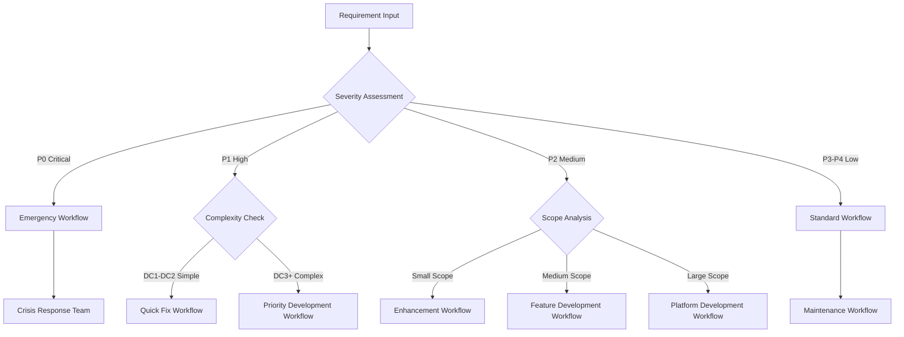

# G1 Adaptive Workflow Selection Logic
## Intelligent Workflow Design and Persona Orchestration

**Date**: August 27, 2025  
**Purpose**: Define the AI-driven logic for dynamic workflow creation and optimal persona assignment

---

## 🧠 **Workflow Intelligence Engine**

### **Core Decision Framework**
```yaml
Decision_Inputs:
  Requirement_Analysis:
    - Severity classification (P0-P4)
    - Priority levels (BP1-BP4, TP1-TP4)
    - Complexity assessment (DC1-DC5)
    - Risk evaluation (TR1-TR5)
    - Scope definition (Micro to Enterprise)

  Context_Factors:
    - Current system load
    - Team availability
    - Business constraints
    - Technical constraints
    - Time constraints

  Historical_Data:
    - Similar requirement patterns
    - Success rates by workflow type
    - Resource efficiency metrics
    - Quality outcomes
    - Timeline accuracy
```

### **AI-Powered Workflow Designer**
```yaml
Persona: workflow-designer

System_Prompt: |
  "You are the Workflow Designer, responsible for creating optimal development workflows 
  based on requirement characteristics. Analyze the input requirements and design a 
  custom workflow that maximizes efficiency, quality, and success probability.

  Consider:
  - Requirement complexity and risk
  - Available resources and constraints
  - Historical success patterns
  - Quality requirements
  - Timeline constraints
  - Integration complexity

  Design workflows that are:
  - Adaptive to requirement characteristics
  - Resource-efficient
  - Quality-focused
  - Risk-appropriate
  - Timeline-realistic"

Decision_Process:
  1. Requirement classification analysis
  2. Historical pattern matching
  3. Resource constraint evaluation
  4. Risk assessment and mitigation
  5. Optimal workflow architecture design
  6. Quality gate definition
  7. Success criteria establishment
```

---

## 🔀 **Workflow Pattern Library**

### **Emergency Response Workflows**

#### **P0 Critical Bug Fix Workflow**
```yaml
Workflow_Type: "Emergency Crisis Response"
Trigger_Conditions:
  - Severity: P0
  - Business_Priority: BP1
  - System_Impact: "Complete outage or critical failure"

Workflow_Phases:
  Phase_1_Emergency_Response:
    Duration: "0-30 minutes"
    Parallel_Execution: true
    
    Stream_1_Analysis:
      - bug-analyst: Root cause identification
      - system-architect: Impact assessment
      - devops-engineer: Infrastructure analysis
    
    Stream_2_Communication:
      - project-manager: Stakeholder notification
      - technical-writer: Status page updates
      - customer-success: Customer communication
    
    Exit_Criteria:
      - Root cause identified
      - Fix approach determined
      - Stakeholders notified

  Phase_2_Emergency_Fix:
    Duration: "30-180 minutes"
    Sequential_Execution: true
    
    Activities:
      - senior-developer: Hot fix implementation
      - security-specialist: Security validation
      - qa-specialist: Critical path testing
      - devops-engineer: Emergency deployment
    
    Quality_Gates:
      - Code review (expedited)
      - Security scan (automated)
      - Critical path tests (pass)
      - Rollback plan (ready)

  Phase_3_Validation:
    Duration: "15-60 minutes"
    Monitoring_Focus: true
    
    Activities:
      - system-architect: System health monitoring
      - qa-specialist: Production validation
      - customer-success: User impact assessment
      - devops-engineer: Infrastructure monitoring
    
    Success_Criteria:
      - Error rate normalized
      - System performance restored
      - User impact eliminated
      - Monitoring alerts cleared

Resource_Allocation:
  Team_Size: 7-9 personas
  Escalation_Path: "Executive immediate notification"
  Communication_Frequency: "Every 15 minutes"
  Success_Metrics: "MTTR < 4 hours, no regression issues"
```

#### **P0 Security Incident Workflow**
```yaml
Workflow_Type: "Security Emergency Response"
Trigger_Conditions:
  - Security breach detected
  - Data exposure risk
  - Authentication compromise

Additional_Personas:
  - security-specialist: Incident commander
  - compliance-officer: Regulatory response
  - legal-advisor: Legal implications
  - data-protection-officer: Privacy impact

Special_Procedures:
  - Immediate access logging
  - Evidence preservation
  - Regulatory notification timeline
  - Customer notification process
```

### **Standard Development Workflows**

#### **P1 High Priority Feature Fix**
```yaml
Workflow_Type: "Priority Feature Resolution"
Trigger_Conditions:
  - Severity: P1
  - Business_Priority: BP1-BP2
  - Complexity: DC1-DC3

Workflow_Phases:
  Phase_1_Analysis:
    Duration: "2-8 hours"
    
    Core_Team:
      - bug-analyst: Deep root cause analysis
      - solution-architect: Solution design
      - qa-specialist: Test impact analysis
    
    Deliverables:
      - Root cause analysis document
      - Fix approach recommendation
      - Risk assessment report
      - Testing strategy plan

  Phase_2_Development:
    Duration: "4-24 hours"
    
    Core_Team:
      - senior-developer: Fix implementation
      - qa-specialist: Test development
      - technical-writer: Documentation updates
    
    Quality_Gates:
      - Code review (thorough)
      - Unit test coverage > 95%
      - Integration test validation
      - Security scan (if applicable)

  Phase_3_Validation:
    Duration: "2-8 hours"
    
    Activities:
      - qa-specialist: Comprehensive testing
      - business-analyst: Acceptance validation
      - performance-specialist: Performance testing
      - devops-engineer: Deployment preparation

Resource_Allocation:
  Team_Size: 5-7 personas
  Timeline: "24-48 hours total"
  Communication: "Every 4 hours"
```

### **Enhancement Development Workflows**

#### **Medium Complexity Feature Enhancement**
```yaml
Workflow_Type: "Standard Feature Development"
Trigger_Conditions:
  - Severity: P2
  - Complexity: DC3-DC4
  - Timeline: 1-4 weeks

Workflow_Architecture:
  Parallel_Streams: 3
  
  Stream_1_Requirements:
    - business-analyst: Requirements refinement
    - ui-ux-designer: User experience design
    - solution-architect: Technical requirements
  
  Stream_2_Foundation:
    - technical-architect: Architecture planning
    - database-specialist: Data model design
    - security-specialist: Security requirements
  
  Stream_3_Planning:
    - project-manager: Project planning
    - qa-specialist: Test strategy design
    - devops-engineer: Deployment planning

Development_Phases:
  Phase_1_Design: "2-5 days"
  Phase_2_Development: "1-3 weeks" 
  Phase_3_Testing: "3-7 days"
  Phase_4_Integration: "1-3 days"
  Phase_5_Deployment: "1-2 days"

Quality_Framework:
  - Requirements traceability: 100%
  - Test coverage: > 90%
  - Performance benchmarks: Meet SLA
  - Security compliance: Full validation
  - Documentation: Complete
```

### **Large Scale Project Workflows**

#### **Enterprise Platform Development**
```yaml
Workflow_Type: "Enterprise Development Lifecycle"
Trigger_Conditions:
  - New major system/platform
  - Complexity: DC4-DC5
  - Timeline: 3-12 months
  - Team: 15+ personas

Workflow_Structure:
  Governance_Layer:
    - project-manager: Overall coordination
    - technical-architect: Technical leadership
    - solution-architect: Solution oversight
    - business-analyst: Requirements management

  Development_Streams:
    Backend_Stream:
      - senior-developer: API development
      - database-specialist: Data architecture
      - integration-specialist: System integration
      - performance-specialist: Optimization
    
    Frontend_Stream:
      - frontend-developer: Web application
      - mobile-developer: Mobile applications
      - ui-ux-designer: User experience
      - accessibility-specialist: Compliance
    
    Quality_Stream:
      - qa-specialist: Testing strategy
      - security-specialist: Security testing
      - performance-specialist: Load testing
      - compliance-officer: Regulatory validation
    
    Operations_Stream:
      - devops-engineer: Infrastructure
      - cloud-architect: Cloud strategy
      - monitoring-specialist: Observability
      - support-specialist: Operational readiness

Milestone_Framework:
  Discovery_Phase: "2-4 weeks"
  Design_Phase: "3-6 weeks"  
  Foundation_Phase: "4-8 weeks"
  Development_Phase: "8-20 weeks"
  Integration_Phase: "2-6 weeks"
  Testing_Phase: "3-8 weeks"
  Deployment_Phase: "1-4 weeks"
```

---

## 🤖 **Intelligent Persona Assignment**

### **Team Structure Architect Logic**
```yaml
Persona: team-structure-architect

Assignment_Algorithm:
  Input_Analysis:
    - Workflow complexity assessment
    - Required skill combinations
    - Workload distribution optimization
    - Persona availability and capacity
    - Historical performance data

  Core_Team_Selection:
    Priority_1: Essential personas (cannot proceed without)
    Priority_2: Important personas (significant impact on quality/speed)
    Priority_3: Supporting personas (nice to have, efficiency gains)
    Priority_4: Optional personas (luxury additions)

  Optimization_Factors:
    - Minimize team size while maintaining quality
    - Balance workload across personas
    - Ensure knowledge transfer and backup coverage
    - Consider persona specialization and strengths
    - Account for concurrent project demands

Decision_Matrix:
  Small_Changes (DC1-DC2):
    Core_Team_Size: 2-4 personas
    Specialization_Depth: Generalists preferred
    Coordination_Overhead: Minimal
    
  Medium_Changes (DC3):
    Core_Team_Size: 4-8 personas
    Specialization_Depth: Mixed generalists/specialists
    Coordination_Overhead: Moderate
    
  Large_Changes (DC4-DC5):
    Core_Team_Size: 8-15+ personas
    Specialization_Depth: Specialists required
    Coordination_Overhead: Significant coordination needed
```

### **Dynamic Team Scaling**
```yaml
Scaling_Triggers:
  Scale_Up:
    - Complexity higher than initially assessed
    - Timeline compression required
    - Quality issues detected
    - Risk mitigation needed
    - Scope expansion approved

  Scale_Down:
    - Complexity lower than expected
    - Timeline extended
    - Resource constraints
    - Scope reduction
    - Milestone completion

Scaling_Strategy:
  Gradual_Addition:
    - Add specialists as needed
    - Maintain core team stability
    - Ensure smooth knowledge transfer
    - Monitor team dynamics
    
  Strategic_Reduction:
    - Remove non-essential personas first
    - Maintain critical skill coverage
    - Redistribute responsibilities
    - Document knowledge transfer
```

---

## 🔄 **Adaptive Workflow Modification**

### **Real-Time Workflow Adjustment**
```yaml
Adjustment_Triggers:
  Progress_Indicators:
    - Behind schedule (>20% variance)
    - Ahead of schedule (>15% variance)  
    - Quality issues detected
    - Scope changes requested
    - Risk factors emerged

  External_Factors:
    - Resource availability changes
    - Business priority shifts
    - Technology constraint discoveries
    - Customer feedback impact
    - Competitive pressure changes

Adjustment_Mechanisms:
  Phase_Modification:
    - Extend/compress timelines
    - Add/remove activities
    - Adjust quality gates
    - Modify deliverables

  Resource_Reallocation:
    - Add specialist personas
    - Reassign responsibilities
    - Change team structure
    - Adjust effort distribution

  Process_Adaptation:
    - Switch workflow patterns
    - Modify communication frequency
    - Adjust review cycles
    - Change approval processes
```

### **Learning and Pattern Evolution**
```yaml
Pattern_Learning:
  Success_Patterns:
    - Track workflows that deliver on time/budget/quality
    - Identify optimal team compositions
    - Recognize effective phase structures
    - Document successful practices

  Failure_Analysis:
    - Analyze delayed or failed projects
    - Identify bottleneck patterns
    - Recognize resource allocation issues
    - Document lessons learned

  Pattern_Evolution:
    - Refine workflow templates based on outcomes
    - Optimize persona assignments
    - Improve time estimations
    - Enhance quality gates

Continuous_Improvement:
  Monthly_Reviews:
    - Workflow effectiveness analysis
    - Team performance assessment
    - Quality outcome evaluation
    - Timeline accuracy review

  Quarterly_Optimization:
    - Pattern library updates
    - Algorithm refinements
    - Process improvements
    - Tool integration enhancements
```

---

## 📊 **Workflow Selection Decision Tree**

### **Primary Classification Logic**


### **Secondary Optimization Factors**
```yaml
Resource_Constraints:
  High_Availability: "Use standard workflows with full teams"
  Medium_Availability: "Optimize team size, extend timelines"
  Low_Availability: "Minimal viable teams, focus on critical path"

Timeline_Constraints:
  Urgent: "Parallel execution, larger teams, accept higher cost"
  Standard: "Balanced approach, optimize for efficiency"
  Flexible: "Sequential execution, smaller teams, optimize for cost"

Quality_Requirements:
  Mission_Critical: "Enhanced quality gates, additional validation"
  Standard: "Normal quality processes"
  Experimental: "Lightweight validation, rapid iteration"
```

---

## 🎯 **Success Metrics and Optimization**

### **Workflow Performance Metrics**
```yaml
Delivery_Metrics:
  - On-time delivery rate
  - Budget adherence
  - Scope completion percentage
  - Quality defect rates
  - Customer satisfaction scores

Efficiency_Metrics:
  - Resource utilization rates
  - Team productivity scores
  - Communication effectiveness
  - Process overhead ratios
  - Rework percentages

Quality_Metrics:
  - Defect density
  - Test coverage achievement
  - Performance benchmark achievement
  - Security compliance scores
  - Documentation completeness
```

### **Optimization Algorithms**
```yaml
Performance_Optimization:
  Pattern_Analysis:
    - Identify high-performing workflow patterns
    - Correlate team compositions with success rates
    - Analyze timeline accuracy by workflow type
    - Evaluate quality outcomes by process variation

  Predictive_Modeling:
    - Estimate completion times based on historical data
    - Predict resource requirements for similar projects
    - Forecast potential risks and bottlenecks
    - Model impact of team composition changes

  Continuous_Learning:
    - Update algorithms based on new outcomes
    - Refine decision criteria based on results
    - Evolve workflow patterns based on successes
    - Improve resource allocation based on efficiency data
```

---

**This adaptive workflow logic ensures G1 dynamically creates optimal development processes tailored to each requirement's unique characteristics while continuously learning and improving from outcomes.**