# G1 Solution Architecture
## AI-Powered Software Development Platform

**Version:** 3.0  
**Date:** 2025-08-27  
**Document Type:** Enhanced Technical Architecture Specification

---

## 📋 **Table of Contents**

1. [Architecture Overview](#architecture-overview)
2. [Core Components](#core-components)
3. [AI Personas Ecosystem](#ai-personas-ecosystem)
4. [Workflow Orchestration](#workflow-orchestration)
5. [Communication Architecture](#communication-architecture)
6. [Service Infrastructure](#service-infrastructure)
7. [Data Flow & Integration](#data-flow--integration)
8. [Security & Compliance](#security--compliance)
9. [Scalability & Performance](#scalability--performance)
10. [Deployment Architecture](#deployment-architecture)

---

## 🏗️ **Architecture Overview**

### **System Vision**
G1 is a revolutionary AI-powered software development platform that transforms business requirements into production-ready software through a network of **30 specialized AI personas** working in intelligent coordination, capable of handling everything from emergency production fixes to enterprise-scale software development.

### **Architecture Principles**
- **100% Persona-Driven**: All decisions made by AI personas, zero hardcoded rules
- **Dynamic Workflow Adaptation**: Workflows designed in real-time based on project needs
- **Microservices Architecture**: Distributed, scalable, and maintainable
- **Event-Driven Communication**: Asynchronous, resilient communication patterns
- **Context-Aware Processing**: Intelligent context preservation and sharing

### **High-Level Architecture Diagram**

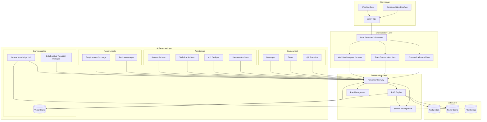

---

## 🎯 **Core Components**

### **1. Pure Persona-Driven Orchestrator**

**Purpose**: Central coordination engine that executes workflows designed entirely by AI personas.

**Key Features**:
- **Zero Hardcoded Rules**: All logic determined by AI personas
- **Dynamic Workflow Execution**: Adapts to any project complexity
- **Meta-Orchestration**: Uses AI personas to design workflows
- **Context Management**: Preserves requirements throughout execution
- **Quality Assurance**: Built-in verification at every step

**Technical Specifications**:
- **Language**: Python 3.11+
- **Framework**: AsyncIO for concurrent processing
- **API**: RESTful interfaces with OpenAPI specification
- **Scalability**: Horizontal scaling support
- **Monitoring**: Comprehensive logging and metrics

### **2. AI Personas Gateway**

**Purpose**: Unified interface for all AI persona interactions with intelligent routing and context management.

**Key Features**:
- **Persona Management**: 22+ specialized AI personas
- **Context-Aware Routing**: Intelligent request routing
- **Response Caching**: Performance optimization
- **Load Balancing**: Distributed persona processing
- **Health Monitoring**: Real-time persona availability

**Technical Specifications**:
- **Framework**: FastAPI with async processing
- **Port**: 8013 (managed via port management service)
- **Authentication**: JWT-based security
- **Rate Limiting**: Configurable request throttling
- **Circuit Breaker**: Resilience patterns

### **3. RAG (Retrieval-Augmented Generation) Engine**

**Purpose**: Advanced AI processing engine that combines retrieval and generation for intelligent responses.

**Key Features**:
- **Vector Search**: Semantic similarity matching
- **Context Integration**: Combines multiple information sources
- **LLM Integration**: OpenAI/Claude/Local models support
- **Knowledge Base**: Dynamic knowledge management
- **Response Generation**: Contextually aware responses

**Technical Specifications**:
- **Port**: 8003
- **Vector Database**: Pinecone/ChromaDB support
- **Embedding Models**: OpenAI/Sentence-Transformers
- **Cache Layer**: Redis for response caching
- **Security**: API key management via secrets service

---

## 🤖 **AI Personas Ecosystem**

### **Persona Categories**

#### **1. Meta-Orchestration Personas**
These personas design and manage the workflow itself:

| Persona | Role | Key Responsibilities |
|---------|------|---------------------|
| **Workflow Designer** | SDLC Workflow Design Specialist | - Design optimal SDLC phases<br>- Select appropriate personas<br>- Create workflow sequences |
| **Team Structure Architect** | Multi-Team Design Specialist | - Design optimal team structures<br>- Define team boundaries<br>- Plan coordination strategies |
| **Communication Architect** | Communication Strategy Designer | - Design communication patterns<br>- Prevent anti-patterns<br>- Select communication personas |

#### **2. SDLC Core Personas**
Traditional software development roles as AI personas:

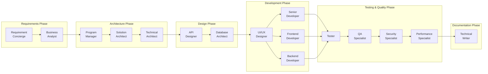

#### **3. Communication Personas**
Specialized personas for managing information flow:

| Persona | Purpose | Key Functions |
|---------|---------|---------------|
| **Central Knowledge Hub** | Single source of truth | - Store original requirements<br>- Provide role-appropriate context<br>- Track interpretation changes |
| **Verification Service** | Understanding validation | - Verify persona understanding<br>- Assess accuracy scores<br>- Identify clarification needs |
| **Collaborative Transition Manager** | Smooth handoffs | - Facilitate collaborative transitions<br>- Manage knowledge transfer<br>- Ensure information fidelity |

#### **4. Enhanced Development Personas**
Specialized development expertise for modern applications:

| Persona | Role | Key Capabilities |
|---------|------|------------------|
| **Senior Developer** | Emergency Response & Advanced Development | - Critical production issue resolution<br>- Complex feature implementation<br>- Technical leadership |
| **Frontend Developer** | Client-Side Development | - React/Vue/Angular development<br>- Responsive design<br>- Performance optimization |
| **Backend Developer** | Server-Side Development | - API development & database integration<br>- Authentication systems<br>- Microservices architecture |
| **UI/UX Designer** | User Experience Design | - User research & prototyping<br>- Accessibility design<br>- Design systems |
| **Security Specialist** | Cybersecurity Expert | - Threat assessment<br>- Security implementation<br>- Compliance validation |
| **System Architect** | Infrastructure Design | - System-level architecture<br>- Scalability planning<br>- Reliability engineering |
| **Performance Specialist** | Optimization Expert | - Performance analysis<br>- Load testing<br>- Capacity planning |
| **Technical Writer** | Documentation Specialist | - API documentation<br>- User guides<br>- Knowledge management |

#### **5. Operational & Support Personas**
Additional expertise for production systems:

- **Infrastructure Engineer**: DevOps and deployment automation
- **DevOps Specialist**: CI/CD pipeline management
- **Integration Team Leader**: Cross-team coordination
- **Team Lead Coordinator**: Multi-team management
- **Compliance Auditor**: Standards compliance validation
- **Interface Validator**: Data contract enforcement
- **Queue Manager**: Request routing optimization

### **Persona Intelligence Framework**

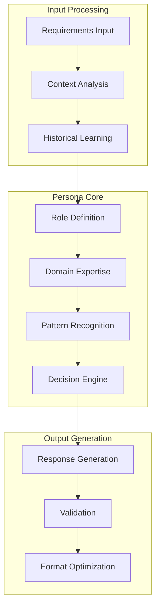

---

## 🔄 **Workflow Orchestration**

### **Dynamic Workflow Design Process**

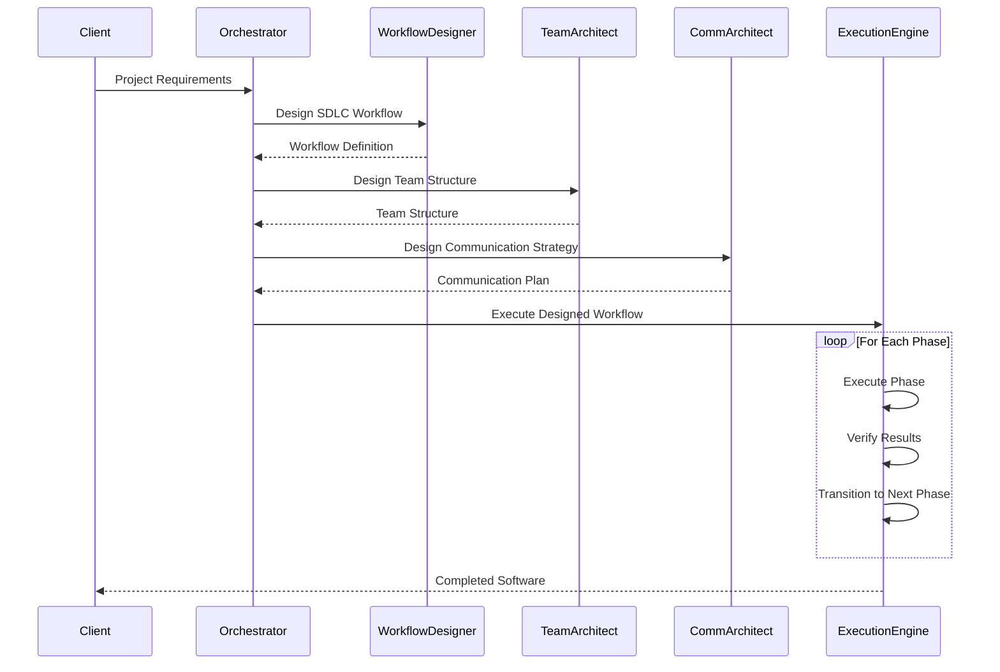

### **Workflow Adaptation Engine**

**Dynamic Phase Selection**:
- AI analyzes project complexity
- Selects appropriate SDLC phases
- Assigns optimal personas to each phase
- Creates dependency mappings

**Parallel Processing**:
- Identifies parallel work opportunities
- Coordinates multi-team development
- Manages resource allocation
- Prevents workflow bottlenecks

**Quality Gates**:
- AI-driven quality checkpoints
- Automatic verification processes
- Context fidelity validation
- Requirement alignment assessment

---

## 📡 **Communication Architecture**

### **Hub-and-Spoke Model**

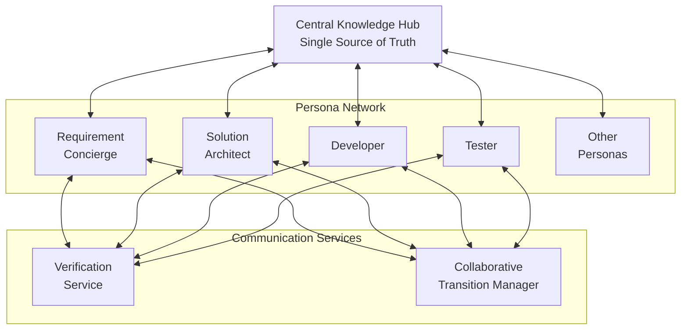

### **Anti-Pattern Prevention**

**Chinese Whispers Prevention**:
- Direct access to original requirements
- Context fidelity tracking
- Understanding verification
- Information loss detection

**Communication Quality Assurance**:
- Automatic accuracy scoring
- Misunderstanding detection
- Clarification triggers
- Context enrichment

**Collaborative Handoffs**:
- Joint review sessions
- Knowledge transfer protocols
- Mentorship coordination
- Quality validation

---

## 🛠️ **Service Infrastructure**

### **Microservices Architecture**

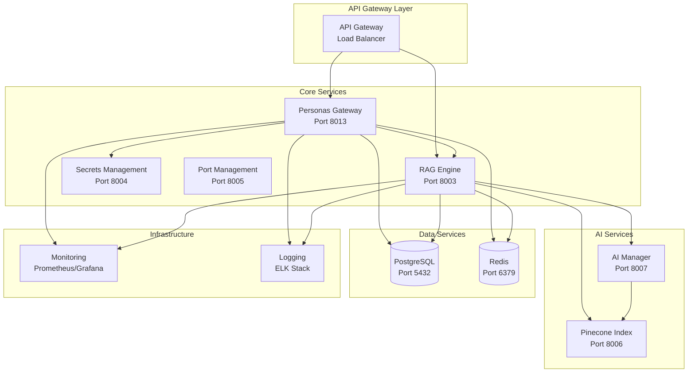

### **Service Specifications**

| Service | Port | Technology | Purpose | Scaling |
|---------|------|------------|---------|---------|
| **Personas Gateway** | 8013 | FastAPI + Python | Persona interface management | Horizontal |
| **RAG Engine** | 8003 | Python + LangChain | AI processing engine | Horizontal |
| **Secrets Management** | 8004 | FastAPI + Vault | Secure credential management | Redundant |
| **Port Management** | 8005 | FastAPI + SQLite | Dynamic port allocation | Single instance |
| **AI Manager** | 8007 | Python + AI SDKs | AI model orchestration | Horizontal |
| **Pinecone Index** | 8006 | Python + Pinecone | Vector database interface | Horizontal |

### **Container Orchestration**

```yaml
# Docker Compose Architecture
version: '3.8'

services:
  personas-gateway:
    image: g1/personas-gateway:latest
    ports: ["8013:8013"]
    depends_on: [rag-engine, secrets-management]
    environment:
      - RAG_ENGINE_URL=http://rag-engine:8003
      - SECRETS_SERVICE_URL=http://secrets-management:8004
    healthcheck:
      test: ["CMD", "curl", "-f", "http://localhost:8013/health"]
      interval: 30s
      timeout: 10s
      retries: 3

  rag-engine:
    image: g1/rag-engine:latest
    ports: ["8003:8003"]
    depends_on: [secrets-management, postgres, redis]
    environment:
      - POSTGRES_URL=postgresql://postgres:5432/rag_db
      - REDIS_URL=redis://redis:6379
      - SECRETS_SERVICE_URL=http://secrets-management:8004
```

---

## 🔄 **Data Flow & Integration**

### **Request Processing Flow**

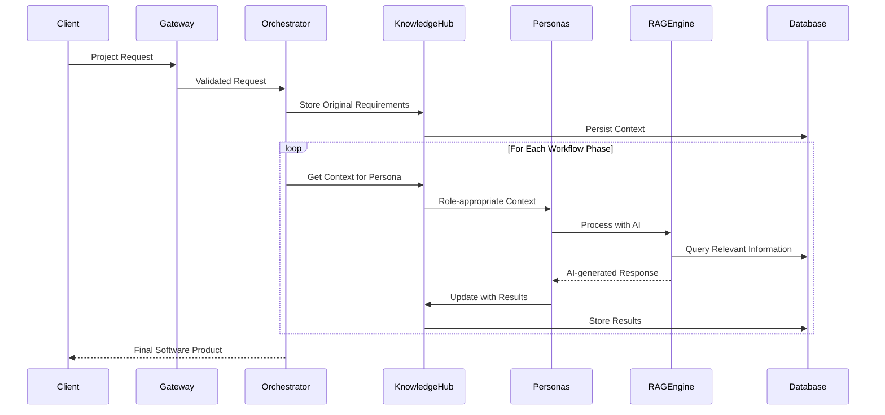

### **Context Management**

**Context Types**:
- **Original Requirements**: Immutable source of truth
- **Role Context**: Persona-specific information
- **Workflow Context**: Phase and dependency information
- **Historical Context**: Learning from previous executions

**Context Enrichment**:
- Automatic context expansion
- Related information retrieval
- Cross-reference validation
- Quality scoring

**Context Preservation**:
- Immutable requirement storage
- Version-controlled context
- Audit trail maintenance
- Rollback capabilities

---

## 🔐 **Security & Compliance**

### **Security Architecture**

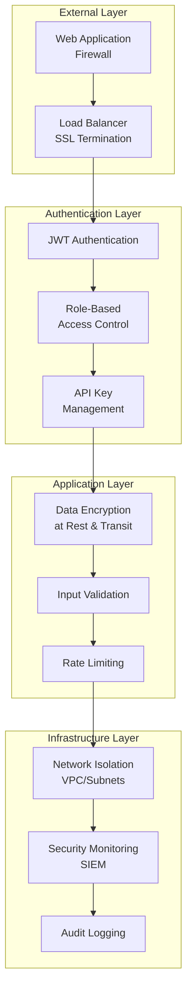

### **Security Features**

**Authentication & Authorization**:
- JWT-based authentication
- Role-based access control (RBAC)
- API key management
- Service-to-service authentication

**Data Protection**:
- Encryption at rest (AES-256)
- Encryption in transit (TLS 1.3)
- Secure secret management
- Data anonymization capabilities

**Compliance Standards**:
- **GDPR**: Data privacy and user rights
- **SOC 2**: Security and availability controls
- **ISO 27001**: Information security management
- **HIPAA**: Healthcare data protection (when applicable)

**Security Monitoring**:
- Real-time threat detection
- Anomaly detection
- Security audit logging
- Compliance reporting

---

## 📊 **Scalability & Performance**

### **Horizontal Scaling Architecture**

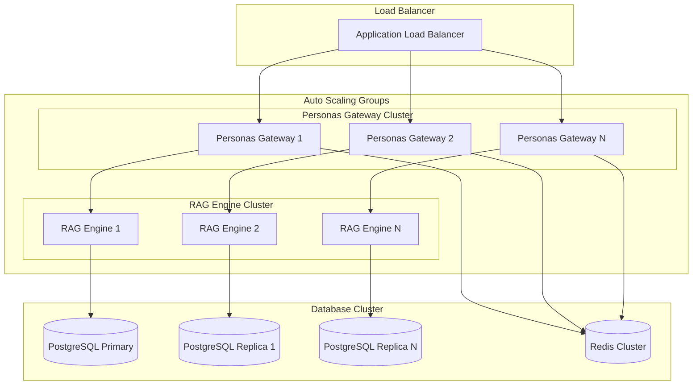

### **Performance Optimization**

**Caching Strategy**:
- **L1 Cache**: In-memory response caching
- **L2 Cache**: Redis distributed caching
- **L3 Cache**: CDN for static content
- **Smart Invalidation**: Context-aware cache management

**Async Processing**:
- Non-blocking I/O operations
- Concurrent persona processing
- Background task queuing
- Streaming responses

**Database Optimization**:
- Connection pooling
- Query optimization
- Index management
- Read replicas

**Performance Metrics**:
- **Response Time**: <200ms average
- **Throughput**: 10,000+ requests/second
- **Availability**: 99.9% uptime SLA
- **Scalability**: Auto-scaling based on demand

---

## 🚀 **Deployment Architecture**

### **Cloud-Native Deployment**

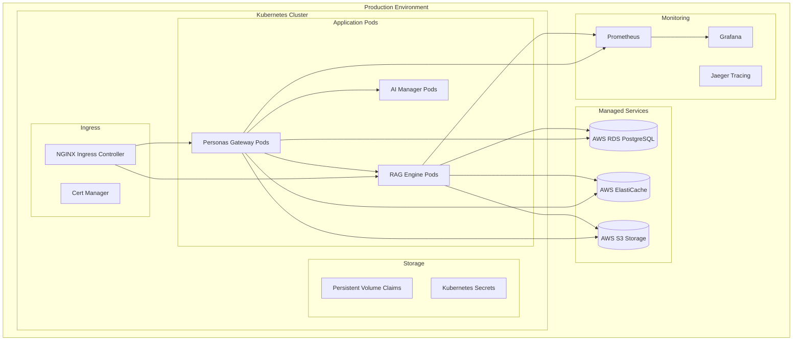

### **Environment Management**

**Multi-Environment Strategy**:
- **Development**: Local Docker Compose
- **Staging**: Kubernetes cluster with production-like setup
- **Production**: Multi-region Kubernetes deployment
- **Disaster Recovery**: Cross-region backup and failover

**CI/CD Pipeline**:

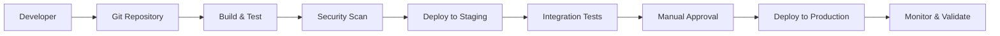

**Deployment Configuration**:
- **Blue-Green Deployments**: Zero-downtime updates
- **Canary Releases**: Gradual feature rollouts
- **Feature Flags**: Runtime feature control
- **Health Checks**: Automated health validation

---

## 📈 **Monitoring & Observability**

### **Observability Stack**

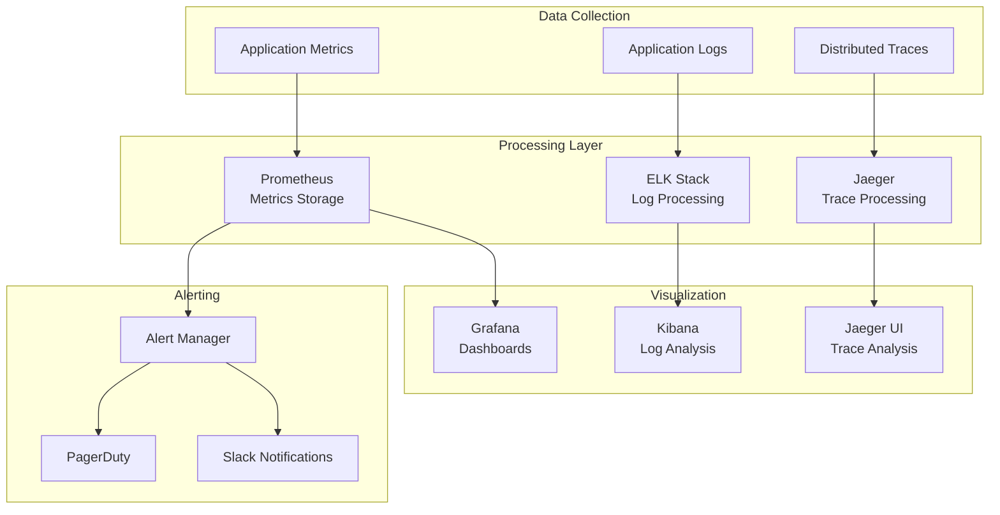

### **Key Metrics & KPIs**

**Business Metrics**:
- Project completion rate
- Average development time
- Customer satisfaction score
- Cost per project

**Technical Metrics**:
- API response times
- Error rates
- Throughput (requests/second)
- Resource utilization

**AI Performance Metrics**:
- Persona response accuracy
- Context preservation rate
- Workflow adaptation success
- Requirement fidelity score

---

## 🎯 **Technology Stack Summary**

### **Backend Technologies**
- **Languages**: Python 3.11+, JavaScript/TypeScript
- **Frameworks**: FastAPI, AsyncIO, LangChain
- **Databases**: PostgreSQL, Redis, Vector Databases
- **AI/ML**: OpenAI API, Claude API, Hugging Face
- **Message Queue**: Redis Pub/Sub, Celery

### **Infrastructure Technologies**
- **Containerization**: Docker, Docker Compose
- **Orchestration**: Kubernetes
- **Cloud Platforms**: AWS, GCP, Azure
- **Service Mesh**: Istio (optional)
- **API Gateway**: NGINX, Kong

### **Development & Operations**
- **Version Control**: Git, GitHub
- **CI/CD**: GitHub Actions, Jenkins
- **Monitoring**: Prometheus, Grafana, ELK Stack
- **Security**: HashiCorp Vault, JWT, OAuth2
- **Testing**: pytest, Jest, Kubernetes test frameworks

---

## 🚀 **Future Architecture Evolution**

### **Planned Enhancements**

**Advanced AI Integration**:
- Multi-modal AI capabilities (text, image, video)
- Domain-specific AI model fine-tuning
- Federated learning across deployments
- Advanced reasoning capabilities

**Enhanced Scalability**:
- Multi-cloud deployment
- Edge computing integration
- Global content delivery network
- Advanced auto-scaling algorithms

**Extended Capabilities**:
- Real-time collaboration features
- Voice-to-code generation
- Automated testing and deployment
- Intelligent project management

**Industry-Specific Modules**:
- Healthcare compliance module
- Financial services security
- Manufacturing integration
- Education-specific features

---

## 📞 **Architecture Support & Documentation**

### **Documentation Resources**
- **API Documentation**: OpenAPI/Swagger specifications
- **Deployment Guides**: Step-by-step deployment instructions
- **Development Setup**: Local development environment guide
- **Troubleshooting**: Common issues and solutions

### **Support Channels**
- **Technical Documentation**: Comprehensive architecture guides
- **Developer Community**: Forums and discussion boards
- **Professional Support**: Enterprise support options
- **Training Resources**: Architecture and integration training

---

**Document Status**: ✅ Complete  
**Last Updated**: 2025-08-27  
**Version Control**: Maintained in Git repository  
**Review Cycle**: Quarterly architecture reviews  

---

*This architecture document represents the current state of the G1 platform and serves as the definitive guide for understanding, deploying, and extending the system.*